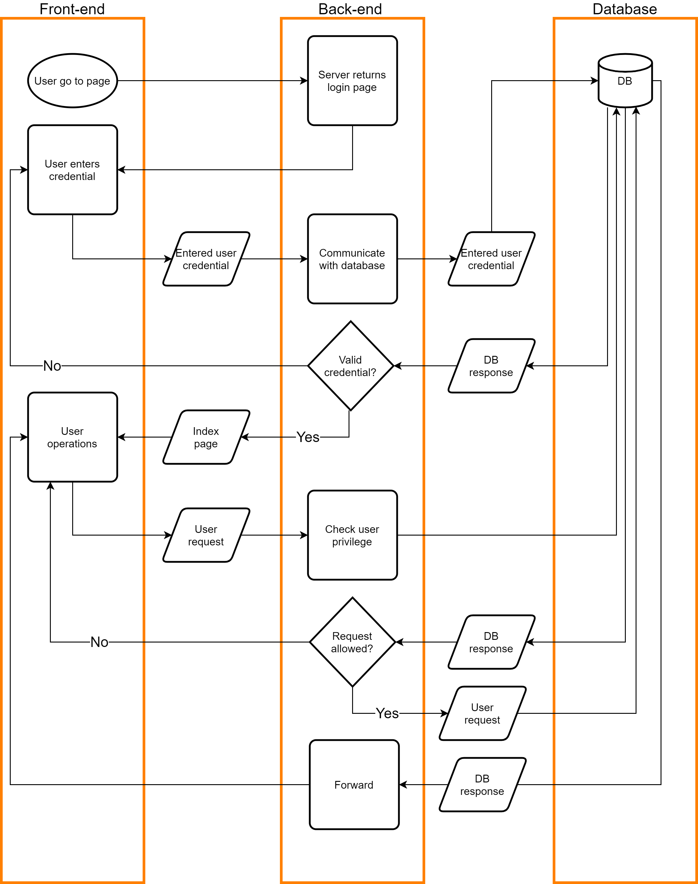

# Book-Keeper

## Rationale

To have a software that records income and expenses with evidence neatly with access control to different people within the same organization.

## Stack

| Component 	| Type    	| Implementation                    	|
|-----------	|---------	|-----------------------------------	|
| Front-end 	| Website 	| React + Bootstrap                 	|
| Back-end  	| Python  	| Nginx + Gunicorn + Flask + Docker 	|
| Database  	| SQL     	| MySQL                             	|

## Structural Diagrams

Client-server model:

## Workflow

1. Team members start with their own branches after git clone.

2. Do not push changes to the master branch directly.

2. Initiate pull requests for merging code into the master branch.

3. Team members need to pull the master branch regularly while working to ensure merge compatibility.

4. Include unit tests in every possible subsection in the implementation.

5. Unit tests will run on Travis CI, a platform for continuous integration that is free for open-source project.

6. Use GitHub features such as project management properly.

7. Always write high quality code that make it easy for others to understand.

## Resources:

To write down ideas: [Google Doc link](https://docs.google.com/document/d/1tP0tIFoo6x8RUdL7WfXMaWVJfe_p7pcsbhEWBY3d9BM/edit#)

[Bootstrap](https://react-bootstrap.github.io)

[React](https://reactjs.org)

[Client-side vs. Server-side vs. Pre-rendering for Web Apps](https://www.toptal.com/front-end/client-side-vs-server-side-pre-rendering)

[REST API concepts and examples](https://www.youtube.com/watch?v=7YcW25PHnAA)

[The Flask Mega-Tutorial](https://blog.miguelgrinberg.com/post/the-flask-mega-tutorial-part-i-hello-world)

[How To Create a React + Flask Project](https://blog.miguelgrinberg.com/post/how-to-create-a-react--flask-project)

[How to Deploy a React + Flask Project](https://blog.miguelgrinberg.com/post/how-to-deploy-a-react--flask-project)

[Testing Flask Applications](https://flask.palletsprojects.com/en/1.1.x/testing/)

[Coverage.py](https://coverage.readthedocs.io/en/coverage-5.1/)

[How NOT to Store Passwords! - Computerphile](https://www.youtube.com/watch?v=8ZtInClXe1Q)

[Running an SQL Injection Attack - Computerphile](https://www.youtube.com/watch?v=ciNHn38EyRc)