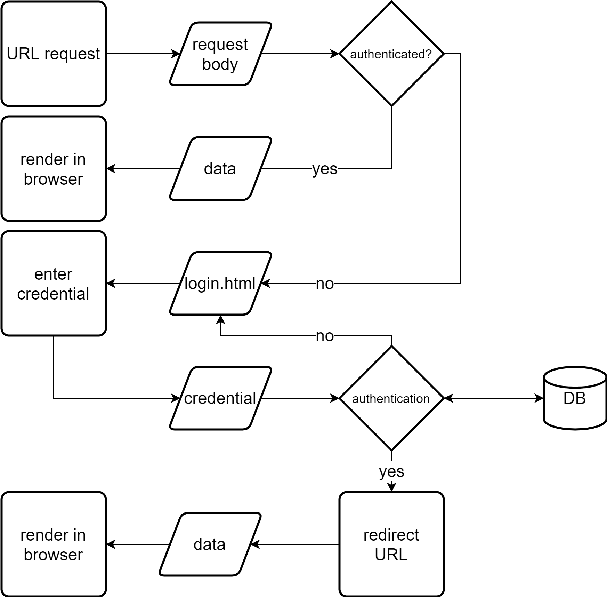

# Book-Keeper

## Rationale

To have a software that records income and expenses with evidence neatly with access control to different people within the same organization.

## Stack

| Component 	| Type    	| Implementation                    	|
|-----------	|---------	|-----------------------------------	|
| Front-end 	| Website 	| React + Bootstrap                 	|
| Back-end  	| Python  	| Nginx + Gunicorn + Flask + Docker 	|
| Database  	| SQL     	| MySQL                             	|

## Structural Diagrams

Client-server model:

URL request handling with user authentication:

## Pages

| `Page`            	| Description                                        	|
|-----------------	|----------------------------------------------------	|
| `index.html`      	| Showcase page for the project.                     	|
| `login.html`      	| Login page.                                        	|
| `register.html`   	| Registration page.                                 	|
| `activation.html` 	| Activation page for new user.                      	|
| `dashboard.html`  	| UI after login with navigation among sub-sections. 	|
| `404.html`        	| 404 not found page.                                	|
| `500.html`        	| 500 internal server error page.                    	|

## APIs

The table excludes interaction with the database or any other external libraries or services.

| `API/Route`                         	| Description                                        	| Return          	|
|-----------------------------------	|----------------------------------------------------	|-----------------	|
| `/index`                              | Index page.                                           | Index page.       |
| `/login`                            	| User login.                                        	| Redirect URL.   	|
| `/register`                         	| User registration.                                 	| Login page.     	|
| `/activate`                           | User activation after receiving email for registration.| Activation result page.          |
| `/dashboard/<username>`            	| Return dashboard page.                             	| Dashboard page. 	|
| `/new_reimburse_request/<username>`  	| Create a new reimbursement request.                	| Boolean.        	|
| `/cencel_reimburse_request`         	| Cancel an existing reimbursement request.          	| Boolean.        	|
| `/see_reimburse_history/<username>` 	| See the submitted reimbursement history of a user. 	| JSON.           	|
| `/account_settings/<username>`      	| Page for displaying account settings.               	| JSON.           	|
| `/change_account_settings/<setting>`  | Change account settings.                              | Boolean.          |
| `/process_reimburse`                	| Process submitted reimbursement requests.          	| Boolean.        	|
| `/logout/<username>`               	| User logout.                                       	| Login page.     	|
| `/privacy_policy`                     | Privacy policy page.                                  | Static page.      |
| `/terms_of_service`                   | Terms of service page.                                | Static page.      |

## Workflow

1. Team members start with their own branches after git clone.

2. Do not push changes to the master branch directly.

2. Initiate pull requests for merging code into the master branch.

3. Team members need to pull the master branch regularly while working to ensure merge compatibility.

4. Include unit tests in every possible subsection in the implementation.

5. Unit tests will run on Travis CI, a platform for continuous integration that is free for open-source project.

6. Use GitHub features such as project management properly.

7. Always write high quality code that make it easy for others to understand.

## Deployment

1. Get a Linux server running Debian or Ubuntu.

2. Configure the server firewall rules from the vendor console.

3. Clone the code to the production server.

4. Change to the **book-keeper-back-end** directory. 

5. Set the environment variables with the `export` command.

6. Run **deployment.sh**.

## Security

Use [SSL Server Test](https://www.ssllabs.com/ssltest/index.html) for a thorough test report on the security level of the server. It may take several minutes to run.

## Resources:

To write down ideas: [Google Doc link](https://docs.google.com/document/d/1tP0tIFoo6x8RUdL7WfXMaWVJfe_p7pcsbhEWBY3d9BM/edit#)

[Bootstrap](https://react-bootstrap.github.io)

[React](https://reactjs.org)

[Client-side vs. Server-side vs. Pre-rendering for Web Apps](https://www.toptal.com/front-end/client-side-vs-server-side-pre-rendering)

[REST API concepts and examples](https://www.youtube.com/watch?v=7YcW25PHnAA)

[The Flask Mega-Tutorial](https://blog.miguelgrinberg.com/post/the-flask-mega-tutorial-part-i-hello-world)

[How To Create a React + Flask Project](https://blog.miguelgrinberg.com/post/how-to-create-a-react--flask-project)

[How to Deploy a React + Flask Project](https://blog.miguelgrinberg.com/post/how-to-deploy-a-react--flask-project)

[Testing Flask Applications](https://flask.palletsprojects.com/en/1.1.x/testing/)

[Coverage.py](https://coverage.readthedocs.io/en/coverage-5.1/)

[How NOT to Store Passwords! - Computerphile](https://www.youtube.com/watch?v=8ZtInClXe1Q)

[Running an SQL Injection Attack - Computerphile](https://www.youtube.com/watch?v=ciNHn38EyRc)

[How To Serve Flask Applications with Gunicorn and Nginx on Ubuntu 18.04](https://www.digitalocean.com/community/tutorials/how-to-serve-flask-applications-with-gunicorn-and-nginx-on-ubuntu-18-04)